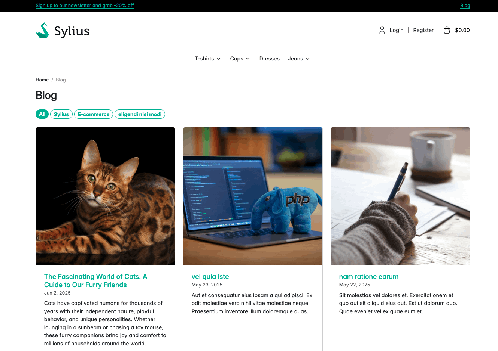
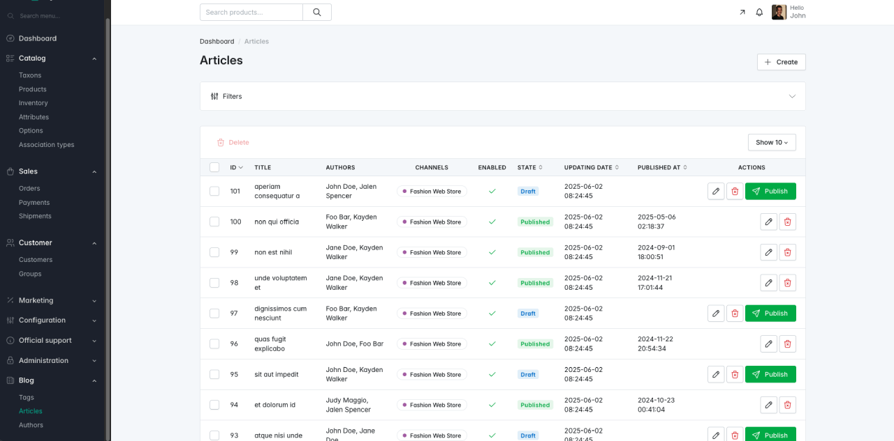

<h1 align="center">Sylius Blog Plugin</h1>

[](https://github.com/monsieurbiz/SyliusBlogPlugin/blob/master/LICENSE.txt)
[](https://github.com/monsieurbiz/SyliusBlogPlugin/actions?query=workflow%3ATests)
[](https://github.com/monsieurbiz/SyliusBlogPlugin/actions?query=workflow%3ASecurity)
[](https://github.com/monsieurbiz/SyliusBlogPlugin/actions?query=workflow%3ASecurity)

This plugin adds a blog to your Sylius project. It allows you to create blog articles, tags and authors.



## Compatibility

| Sylius Version | PHP Version     |
|----------------|-----------------|
| 2.0            | 8.2 - 8.3       |

ℹ️ For Sylius 1.x, see our [1.x branch](https://github.com/monsieurbiz/SyliusBlogPlugin/tree/1.x) and all 1.x releases.

## Installation

If you want to use our recipes, you can add recipes endpoints to your composer.json by running this command:

```bash
composer config --no-plugins --json extra.symfony.endpoint '["https://api.github.com/repos/monsieurbiz/symfony-recipes/contents/index.json?ref=flex/master","flex://defaults"]'
```

Install the plugin via composer:

```bash
composer require monsieurbiz/sylius-blog-plugin
```

<!-- The section on the flex recipe will be displayed when the flex recipe will be available on contrib repo
<details><summary>For the installation without flex, follow these additional steps</summary>
-->

Change your `config/bundles.php` file to add this line for the plugin declaration:

```php
<?php

return [
    //..
    MonsieurBiz\SyliusBlogPlugin\MonsieurBizSyliusBlogPlugin::class => ['all' => true],
];
```

Add the plugin's routing by creating a new file in `config/packages/monsieurbiz_sylius_blog_plugin.yaml` with the following content:

```yaml
imports:
    resource: '@MonsieurBizSyliusBlogPlugin/Resources/config/config.yaml'
```

Add the plugin's routing by creating a new file in `config/routes/monsieurbiz_sylius_blog_plugin.yaml` with the following content:

```yaml
monsieurbiz_blog_plugin:
   resource: '@MonsieurBizSyliusBlogPlugin/Resources/config/routes.yaml'
```

And finally, update your database:

```bash
bin/console doctrine:migrations:migrate
```

## Type of posts



This plugin allows you to create 2 types of posts:
- **Blog articles**: These are the main content of your blog, where you can write detailed posts.
- **Case studies**: These are more focused posts that showcase specific projects or achievements.

Case studies are disabled by default. You can enable them by setting the env var `MONSIEURBIZ_SYLIUS_BLOG_ENABLE_CASE_STUDIES` to `true` in your `.env` file:

```dotenv
MONSIEURBIZ_SYLIUS_BLOG_ENABLE_CASE_STUDIES=true
```

The structure of the code allows you to easily add new types of posts in the future if needed.

## License

This plugin is under the MIT license.
Please see the [LICENSE](LICENSE) file for more information._
